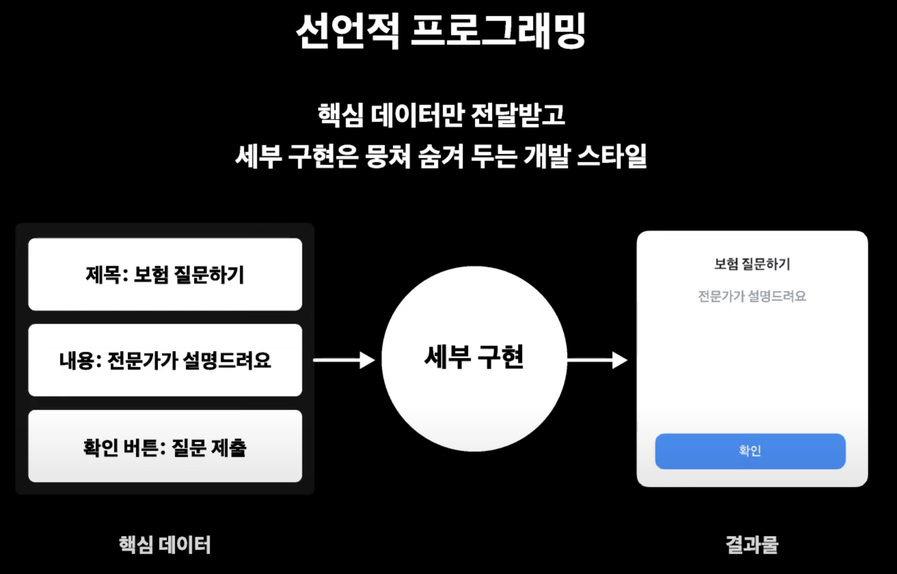
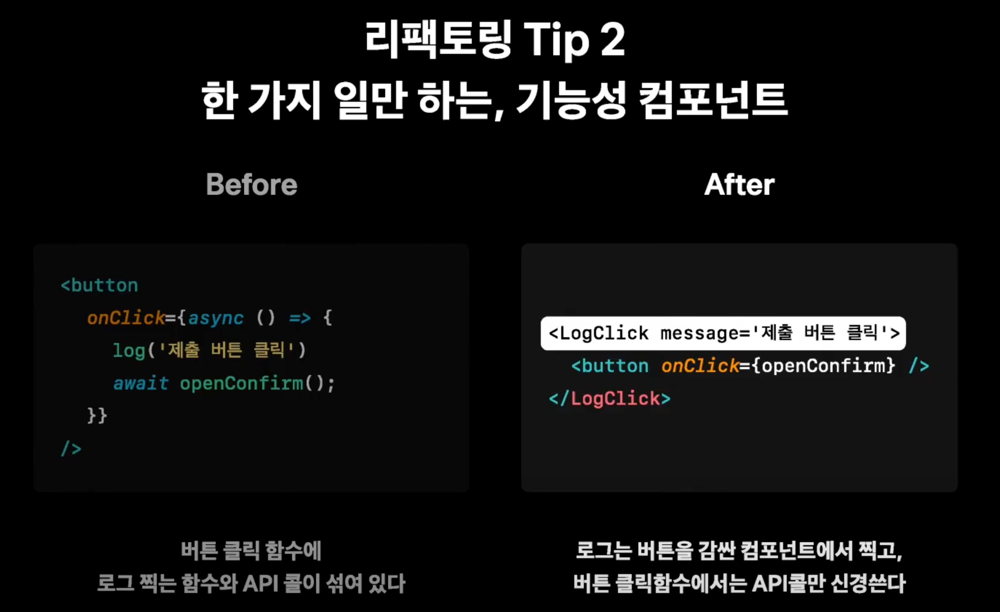
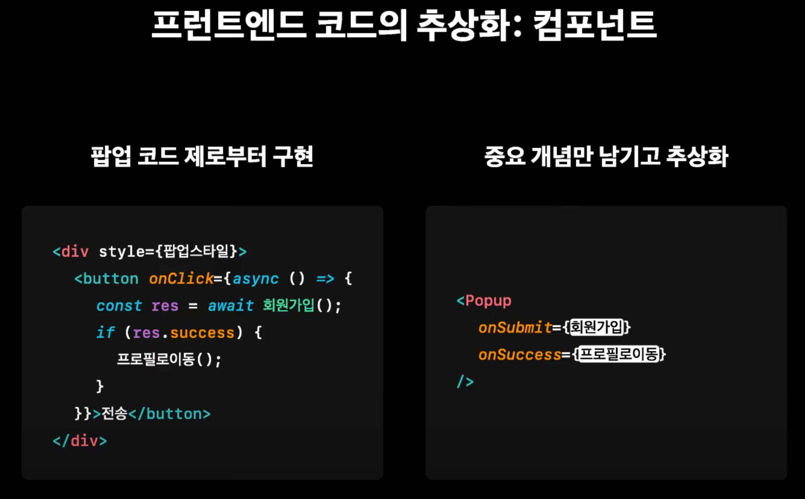
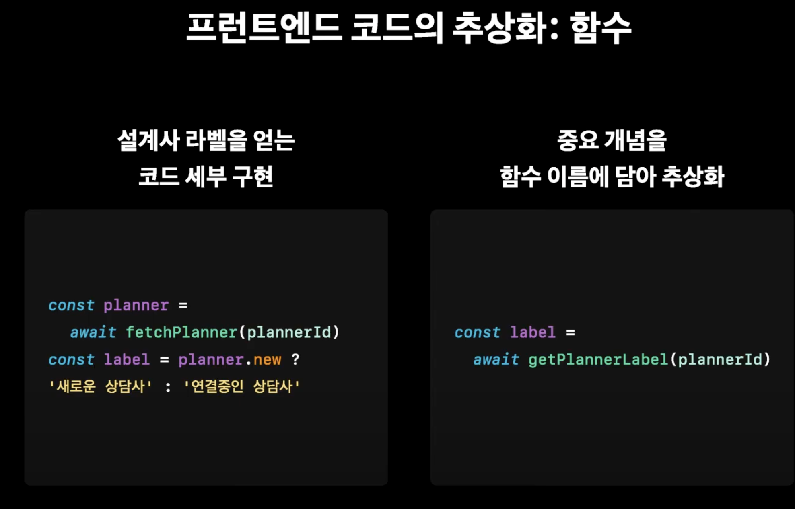
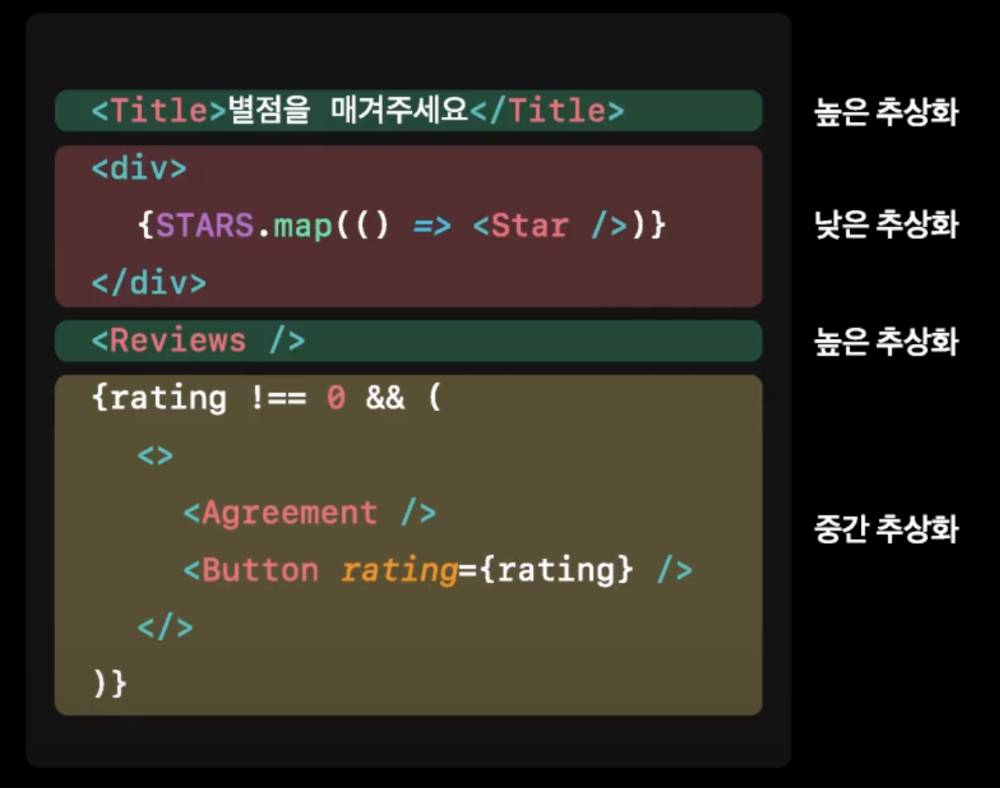

# 클린 코드란? 
: 보통은 중복 줄이기, 명확한 이름 사용하기

but, 실무에서는 더 섬세하게 코드를 정리하는 스킬이 필요하다

## 실무에서 클린코드의 의의

### 지뢰 코드란?
- 흐름 파악이 어렵고, 도메인 맥락 표현이 안되어, 동료에게 물어봐야만 알 수 있는 코드

### 클린 코드란?
- 유지보수 시간의 단축(코드파악, 디버깅, 리뷰)

처음엔 클린코드지만, 기존 코드에 기능을 추가해야하는 상황이라면 더 어려움


## 안일한 코드 추가의 함정

if, 팝업 기능을 추가하고 싶다!
- 기존 코드에 추가하자 하나의 목적인 코드가 흩뿌려짐
- 하나의 함수가 여러가지 일을 하고있음 (세부구현을 모두 읽어야 무슨 함수인지 알게 됨)
- 함수의 세부구현 단계가 제각각
  
그래서! 큰 그림을 보며 리팩토링 해봅시다!

1. **응집도** : 하나의 목적을 가진 코드는 묶어두기 (컴포넌트, 훅 등)
2. **추상화** : 함수 세부구현 단계 통일하기
3. **단일책임** : 함수 하나가 하나의 일만 하도록 쪼개기
   

코드가 길어지더라도!

클린코드 != 짧은코드 == **원하는 로직을 빠르게 찾을 수 있는 코드**

## 로직을 빠르게 찾을 수 있는 코드

### 1. 응집도

  무엇을 뭉쳐야 하는가?
  - 당장 몰라도 되는 디테일

  무엇을 뭉치지 말아야 하는가?
  - 코드 파악에 필수적인 핵심정보
  - ex : 커스텀 훅의 대표적인 안티패턴(주요 로직을 훅 속에 가림)

  **코드 응집 Tip!**
  핵심 데이터와 세부 구현 나누기
  - ex : 핵심 데이터 (팝업 클릭 시 액션, 제목, 내용)
  - ex : 세부 구현 (상태값, 컴포넌트의 세부 마크업 등)

  #### 선언적 프로그래밍
    - 무엇을 하는 함수인지 빠르게 이해 가능
    - 세부구현은 내부에 뭉쳐두기
    - 쉽게 재사용할 수 있음
  ```javascript
  // ex : 예시 컴포넌트
    <Popup
      onClick={질문전송}
      onSuccess={프로필로이동}
    />
  ```
  

  #### 명령적 프로그래밍
  - 세부구현이 노출되어있어 커스텀이 쉽지만 재사용이 어려움
  ```javascript
  // ex : 예시 컴포넌트
    <Popup
      <button onClick={async () => {
        const res = await 회원가입();
        if(res.success) {
          프로필로이동();
        }
      }}>전송</button>
    />
  ```

  그렇다고 선언적인 코드가 무조건 좋은 것은 아니다! 
  => 두개 다 유동적으로 사용하기

### 2. 단일책임

  **리팩토링 Tip!**

1. 한번에 한가지 일만 하는, 명확한 이름의 함수!
  - ex : 폼에서 질문 제출을 하는 함수 이름 
    - handleQuestionSubmit ❌ (중요 포인트가 모두 담겨있지 않음)
      - 결국 코드에 대한 신뢰 하락, 다음부터 함수명을 믿지 못함

2. 한 가지 일만 하는, 기능성 컴포넌트
  
  
3. 조건이 많아지면 한글 이름도 유용해요

### 3. 추상화
- 로직에서 핵심 개념을 뽑아내자
- 정답은 없고, 필요한 만큼만 추상화하면 됨
 


+ 추상화 수준이 섞여있으면 코드 파악이 어려워요!
  - ex : 

## 액션 아이템

내일부터 당장 내 코드에 써먹어보자!

**1. 담대하게 기존 코드 수정하기**
  - 두려워하지 말고 코드를 씹고 뜯고 맛보고 즐기자
  
**2. 큰 그림보는 연습하기**
  - 그때는 맞아도 지금은 틀릴 수 있다
  - 기능 추가 자체는 클린해도, 전체적으로 어지러울 수 있다
  
**3. 팀과 함께 공감대 형성하기**
  - 코드에 정답은 없기에, 명시적으로 이야기하는 시간이 필요하다
  
**4. 문서로 적어보기** 
 - 글로 적어야 명확해진다
    - ex : 향후 어떤 점에서 위험할 수 있는지, 어떻게 개선할 수 있는지